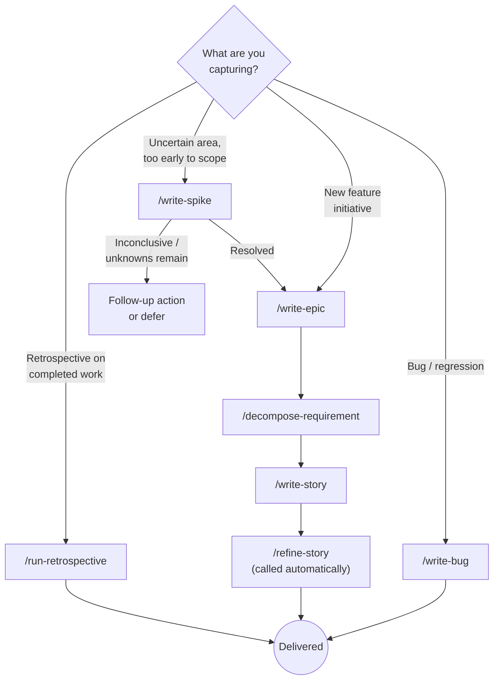
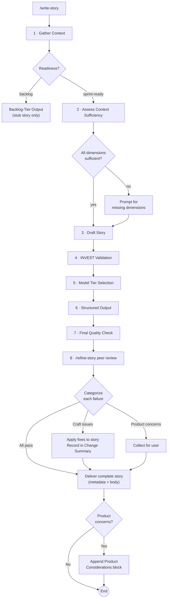
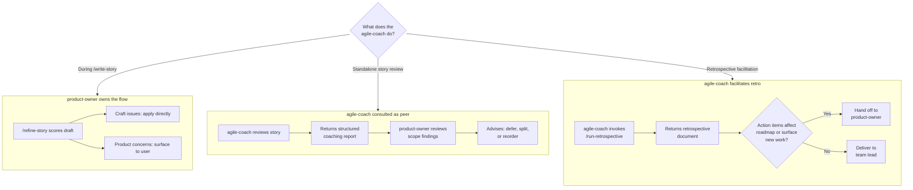

# product-ops

A Claude Code plugin that brings product ownership discipline to AI-assisted development: roadmap awareness, requirement quality, and structured output designed to flow into GitHub Issues and Jira.

Product operations is the operational layer beneath product management — the systems, practices, and hygiene work that keep teams moving efficiently. This plugin focuses on the requirement quality and backlog health side of that problem: Is work scoped precisely enough to implement? Is it sequenced correctly? Does it meet the quality bar before it reaches a sprint?

## What this plugin does

**This is a product owner, not a product manager.** The decisions about what to build and why are yours: product vision, market positioning, strategic feature bets. Once direction is set, the product owner takes over, sequencing the backlog, scoping requirements precisely, and ensuring work is broken down into increments the team can actually ship.

Most AI coding tools jump straight to implementation. This plugin inserts the product ownership layer that should come first: Is this scoped correctly? Is it sequenced properly? Is it broken down into work that can actually ship?

The plugin has two modes:

**Work sequencing:** The `product-owner` agent reads your roadmap and advises on ordering, prerequisites, and phase transitions. It pushes back when proposed work skips a dependency or conflicts with what's planned next. It doesn't decide what to build or why; it organizes and sequences the work within the direction you've already set.

**Requirement authoring:** Five skills formalize requirements (`/write-spike`, `/write-epic`, `/decompose-requirement`, `/write-story`, `/write-bug`); a sixth — `/refine-story` — functions as an internal quality gate called automatically by `/write-story` rather than an authoring entry point. Use `/write-spike` when a work area is too uncertain to scope directly; `/write-epic`, `/decompose-requirement`, and `/write-story` take the output forward for feature work. Use `/write-bug` for bug reports — it applies RIMGEN validation rather than INVEST.

**Retrospective facilitation:** `/run-retrospective` produces a structured retrospective document from a sprint or body-of-work description. It follows the Derby-Larsen five-phase framework with blameless framing and SMART action items. Invoked through the `agile-coach` agent or directly as a skill.

## Architecture

This plugin sits at the top of a three-layer stack:

```
┌─────────────────────────────────────────────────────────────┐
│  Layer 3 · PRODUCT INTELLIGENCE          (this plugin)      │
│  Requirements quality, structured output, roadmap context   │
├─────────────────────────────────────────────────────────────┤
│  Layer 2 · WORKFLOW SKILLS               (official plugins) │
│  github · atlassian — spec-to-backlog, triage, bulk ops     │
├─────────────────────────────────────────────────────────────┤
│  Layer 1 · API ACCESS                    (official plugins) │
│  github · atlassian MCP tools — create issue, update field  │
└─────────────────────────────────────────────────────────────┘
```

This plugin owns Layer 3 only. It produces high-quality requirement artifacts and never calls an API or creates an issue itself. That separation keeps this plugin platform-agnostic and lets the official GitHub and Atlassian Claude Code plugins handle filing without duplication.

## How the pieces fit together

### The agents: sequencing and coaching layer

The `product-owner` agent is a consultative peer, not an implementer. It maintains a roadmap in project memory and uses it to evaluate every significant work request before coding begins.

Invoke it before starting non-trivial work:

> "Should we build the notification system now, or does the event pipeline need to come first?"

Invoke it after completing significant work:

> "We finished the order approval flow. What's next?"

When the conversation turns to authoring requirements, the agent delegates to the skills below.

The `agile-coach` agent is a peer coach for story quality review and retrospective facilitation. It scores story drafts against INVEST criteria and seven coaching principles, returning a structured report with specific rewrites for every failure. Consult it before a story enters the backlog to catch scope boundary problems, implementation-bound acceptance criteria, missing Definition of Done, or horizontal work masquerading as a user story. It also facilitates structured retrospectives over a body of work using `/run-retrospective`, producing blameless observations, root-cause insights, and SMART action items. `agile-coach` and `product-owner` are peers — neither reports to the other.

### The skills: authoring layer

The skills form a natural progression from broad to specific, with a quality gate before backlog entry:

```
Uncertain work area                           Bug report
    │                                              │
    ▼                                              ▼
/write-spike ─────────── Resolve uncertainty  /write-bug ──────── Scaffold bug report
    │                    Problem restatement,                      RIMGEN validation,
    │                    options, findings,                        reproduction steps,
    │                    remaining unknowns,                       severity, priority
    │                    story seed
    │
    ▼
Feature idea (ready to scope)
    │
    ▼
/write-epic ──────────── Scope the initiative
    │                    Problem statement, success metrics,
    │                    in/out of scope, dependencies
    │
    ▼
/decompose-requirement ── Break it into children
    │                     Epic → stories (5–15)
    │                     Story → subtasks (2–8)
    │                     Sequenced by dependency, risk, value
    │
    ▼
/write-story ──────────── Formalize each work item
    │                     INVEST validation, Given/When/Then
    │                     acceptance criteria, technical notes
    │
    ▼
/refine-story ─────────── Quality gate (called by /write-story)
                          INVEST scorecard, 7 coaching principles,
                          specific rewrites for every failure
```

Each requirement authoring skill produces output in the **Requirement Interchange Format (RIF)**: a YAML frontmatter block containing machine-parseable metadata, followed by a human-readable markdown body. The same artifact serves both audiences.

### The output: flowing downstream

RIF output is structured so that official platform plugins can consume it without parsing free-form prose. Fields map directly to issue tracker concepts:

| RIF field | GitHub Issues | Jira |
|-----------|--------------|------|
| `title` | Issue title | Summary |
| `type` | Issue type (Epic/Story) | Issue type |
| `priority` | Projects v2 custom field | Priority field |
| `size` | Projects v2 custom field | Story Points |
| `labels` | Labels | Labels / Components |
| `acceptance_criteria` | `- [ ]` checkboxes in body | Description section |
| `dependencies` | Linked issues | Linked issues (blocks/blocked by) |
| `parent` | Sub-issue parent | Epic Link |

## Flow diagrams

### Skill routing

Shows which skill to use based on the type of work being captured.



### `/write-story` authoring flow

The most complex skill in the plugin. This diagram traces the end-to-end path from invocation to delivered output, including the Step 1 readiness gate, the Step 2 context sufficiency check, and the Step 8 peer-review category split.



Craft issues are mechanical problems fixable without product judgment (AC wording, DoD placement, scope boundary gaps, INVEST failures with clear rewrites). Product concerns are substantive questions requiring user judgment (horizontal work, scope-fit, reclassification, cross-cutting dependencies).

> **Note:** `agile-coach` is never consulted during `/write-story`. The `product-owner` applies craft fixes from `/refine-story` directly and surfaces product concerns to the user. For interactive coaching, consult `agile-coach` in a standalone session.

### Agent delegation routing

Shows when `product-owner` owns the review flow end-to-end vs. when `agile-coach` is consulted as a peer.



In the standalone path, `agile-coach` hands off to `product-owner` when a story's scope belongs to a different phase, has unresolved sequencing dependencies, or was reclassified as a technical task. The `product-owner` then evaluates against the roadmap and advises on next steps.

## A typical workflow

1. **Consult the agent** before starting a new feature area. It checks the roadmap, flags sequencing issues, and confirms this is the right next thing to work on.

2. **Run `/write-epic`** to scope the initiative. You get a structured spec with YAML metadata and a markdown body covering problem statement, success metrics, scope boundaries, and dependencies.

3. **Run `/decompose-requirement`** on the epic to break it into stories. Each story gets its own YAML block with `parent` pointing back to the epic. The output includes a sequencing table showing dependencies and parallelization opportunities.

4. **Run `/write-story`** on individual stories that need full specification. The skill runs INVEST validation, produces a complete story with Given/When/Then acceptance criteria, and automatically runs `/refine-story` as a peer review step. The final output includes a Change Summary when the peer review resulted in revisions.

5. **File with your platform plugin.** Pass the RIF output to the official GitHub or Atlassian Claude Code plugin to create issues, link them, and populate fields without copy-pasting or reformatting.

6. **Close out completed work.** When you report back that work is done, the agent evaluates the reported outcomes against the story's acceptance criteria. If they are met, it says "I believe this story is complete" and asks for your confirmation. Once confirmed, it produces a closure summary with a suggested comment and any follow-up items. Pass that to the platform plugin to post the comment and close the issue.

## When to use what

| Situation | Use |
|-----------|-----|
| "Should we build X now or later?" | `product-owner` agent |
| "What's left in this phase?" | `product-owner` agent |
| "We finished Y. What's next?" | `product-owner` agent |
| "Review this story draft before I file it" | `agile-coach` agent |
| "Run a retrospective on this sprint" | `agile-coach` agent via `/run-retrospective` |
| "This area is too uncertain to scope or story-write" | `/write-spike` |
| "Scope out a new feature area" | `/write-epic` |
| "Break this epic into stories" | `/decompose-requirement` |
| "Break this story into subtasks" | `/decompose-requirement` |
| "Write a proper story for this requirement" | `/write-story` |
| "Score this draft against INVEST and coaching principles" | `/refine-story` |
| "File a structured bug report" | `/write-bug` |

## What this plugin does not do

- Set product vision or decide what features to build
- Make market-level trade-offs; those decisions belong to you
- Call GitHub, Jira, or any external API to create, update, or close issues; those operations are delegated to the official github and atlassian Claude Code plugins
- Directly manage board state or sprint assignments; when a story's acceptance criteria are met, the agent produces a closure summary and asks for your confirmation before you delegate the update to the platform plugin
